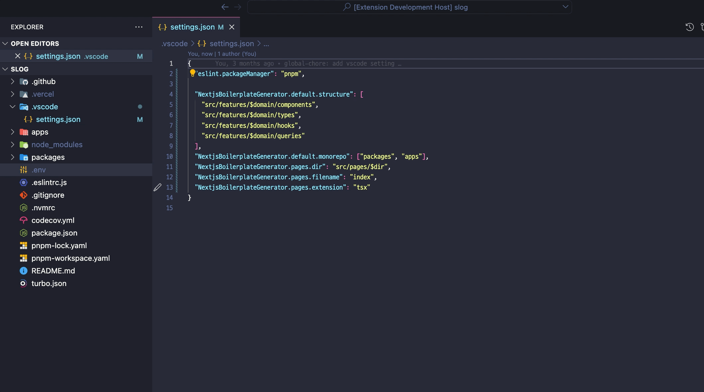

# Next.js boilerplate code generator

[](https://github.com/Sh031224/vscode-nextjs-boilerplate-generator/blob/main/LICENSE)
[](https://marketplace.visualstudio.com/items?itemName=sh031224.nextjs-boilerplate-generator)
[](https://github.com/Sh031224/vscode-nextjs-boilerplate-generator/releases)

### Description


VS Code Extension for new feature development boilerplate code in Next.js.

## ChangeLog

### [Click here](CHANGELOG.md)

## Usage



## Configuration

You can change to the extension's settings through VS Code settings. You can customize

### `NextjsBoilerplateGenerator.default.structure`

A list of folders to create, excluding pages, where `$domin` is the input domain name value.

- `array`

```
[
	"src/features/$domain/components",
	"src/features/$domain/types",
	"src/features/$domain/hooks",
	"src/features/$domain/queries"
]
```

### `NextjsBoilerplateGenerator.default.monorepo`

Folder names containing projects when using monorepo

- `array`

```
[
	"packages",
	"apps"
]
```

### `NextjsBoilerplateGenerator.pages.dir`

Path to the folder directory where the page will be created. $dir is the input page name value.

- `string`

```
"src/pages/$dir"
```

### `NextjsBoilerplateGenerator.pages.filename`

The name of the pages files.

- `string`

```
"index"
```

### `NextjsBoilerplateGenerator.pages.extension`

Extension of pages component.

- `enum`
  <br/><br/>
- `tsx` (default)
- `js`
- `jsx`

## Bugs

Please report [here](https://github.com/sh031224/vscode-nextjs-boilerplate-generator/issues)
